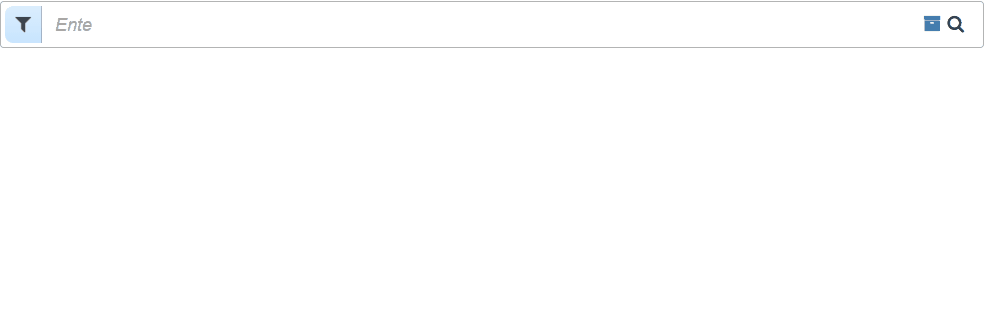

## Pure Angular Advanced Searchbox

&nbsp;&nbsp;&nbsp;

&nbsp;&nbsp;&nbsp;

&nbsp;&nbsp;&nbsp;

&nbsp;&nbsp;&nbsp;

&nbsp;&nbsp;&nbsp;

&nbsp;&nbsp;&nbsp;


##### Pure Angular Advanced Search Box is an implementation to add advanced searching capabilities into a reusable UI to help build parameters based off of filters, queries and operators to send off to a search API.

### Features

- Basic Search Query Input Box
- Filters
- Filter Selectors - Selectors for filters *(Contains, Is Equal To, etc)*.
- Operators - OR/AND support between filters to give more advanced searchbox functionality.
- Grouping (**In Progress**)
- Drag and Drop - Swap / Insert Before and After functionality for filters to change arrangement.
- Validation - Validators on filters allows control over when search get's updated based on valid entries.
- Middlewares - to modify values within filters after user input.
- Externalized Configuration / HTML (**In Progress**)

### TODOs

- [ ] Add grouping around conditionals (In Progress)
- [ ] Build query (SOLR, SQL)
- [ ] Add UI for validation
- [ ] Externalizing templates
- [ ] Update Live DEMO (In Progress)
- [ ] Add ability to only update params via ENTER key or clicking Search Button

### Known Bugs

- [x] Verified - Cannot read property 'store' of undefined - Thanks to @IbrahimHd (**DONE**)

### Screenshots



### [View Demo Here](http://tybeck.github.io/pure-angular-advanced-searchbox/)

### Usage
1. Install with `bower`:
    - `bower install pure-angular-advanced-searchbox`

The bower package contains files in the `dist/` directory with the following includes:

- ui.core.js
- ui.core.min.js
- main.css

Files with the `min` suffix are minified versions to be used in production.

Load the javascript/css and declare your angular dependency:

```html
<!-- dependency includes -->
<script src="bower_components/angular/angular.min.js"></script>
<script src="bower_components/lodash/lodash.js"></script>

<link rel="stylesheet" href="bower_components/components-font-awesome/css/font-awesome.css" />

<!-- pure angular advanced searchbox -->
<script src="bower_components/pure-angular-advanced-searchbox/dist/scripts/ui.core.js"></script>

<link rel="stylesheet" href="bower_components/pure-angular-advanced-searchbox/dist/styles/main.css" />

```

```js
angular.module('myModule', ['paasb']);
```

#### **Example Directive Usage**

```html
<paasb-search-box
  search-params="sOptions"
  paasb-search-box-filtering="sFilters"
  paasb-search-box-enable-filtering-operators="true"
  paasb-search-box-config="sConfig"
  paasb-search-box-auto-complete="sConfig"
  paasb-search-box-cache-filter="true"
  paasb-search-box-filter-selectors="sFilterSelectors"
  paasb-search-box-filter-operators="sFilterOperators"
  placeholder="Enter your query here..."
</paasb-search-box>
```

##### **Description**

The searchbox will return data in JSON format and look something like:

```json
{  
   "filters":[  
      {  
         "condition":"contains",
         "value":"NK",
         "name":"vendor_abbr",
         "$$timestamp":1468518875834,
         "$$modified":1468518875834
      },
      {  
         "condition":"contains",
         "value":"Yellow",
         "name":"color",
         "$$timestamp":1468518875834,
         "$$modified":1468518875834,
         "$$operator":"AND"
      }
   ],
   "operators":[  
      "AND"
   ],
   "query":"Nike Flex"
}
```

\#\#\#\#\#\#\#\#\#\#\#\#\#\#

\#\#\#\#\#\#\#\#\#\#\#\#\#\#

Define the available search parameters / filters in your project:

```js
$scope.sOptions = [];

$scope.sFilters = [
    {
      'name': 'dontFilterMe',
      'displayName': 'I don\'t want to be filtered!',
      'dontFilter': true
    },
    {
      'name': 'cpi',
      'displayName': 'CPI',
      'root': 'Product',
      'middleware': [function (val) {

        if(!isNaN(val)) {

          return (val * 2);

        }

        return val;

      }, function (val) {

        return 'value:' + val;

      }]
    }, {
      'name': 'gender',
      'displayName': 'Vendor Gender',
      'suggestedValues': 'GENDER',
      'suggestedDataPoint': 'data',
      'reloadOnCreate': true,
      'restrictedSuggestedValues': true,
      'multi': true,
      'root': 'Product'
    }, {
      'name': 'upc',
      'displayName': 'UPC',
      'child': 'Size'
    }
];

$scope.sConfig = {
    'delay': 1000, /* How long before paasb fires off a change event */
    'store': true /* Should we store our query/caching in local storage? */
    'showMagnifierAlways': false /* Should we keep magnifier or remove it when there is some sort of query/filter? */
};

$scope.sFilterOperators = [
  {
    "name": "NOT"
  },
  {
    "name": "AND",
    "selected": true
  }, {
    "name": "OR"
  }
];

$scope.sFilterSelectors = [
  {
    "name": "Test",
    "key": "test"
  },
  {
    "name": "Contains",
    "key": "contains",
    "selected": true,
    "notAllowed": [
      "restrictedSuggestedValues"
    ]
  },
  {
    "name": "Does not contain",
    "key": "doesNotContain",
    "notAllowed": [
      "restrictedSuggestedValues"
    ]
  },
  {
    "name": "Is Equal To",
    "key": "isEqualTo"
  },
  {
    "name": "Is Not Equal To",
    "key": "isNotEqualTo"
  },
  {
    "name": "Starts with",
    "key": "startsWith"
  },
  {
    "name": "Ends with",
    "key": "endsWith"
  },
  {
    "name": "Similiarity",
    "key": "similiarity"
  }
];
```

### Available Directive Attributes

<table>
  <thead>
    <tr>
      <th>Name</th>
      <th>Description</th>
      <th>Type</th>
    </tr>
  </thead>
  <tbody>
    <tr>
      <td>search-params</td>
      <td>Object to store search parameters</td>
      <td>object</td>
    </tr>
    <tr>
      <td>paasb-search-box-filtering</td>
      <td>Object array of filters to provide to searchbox</td>
      <td>array[object]</td>
    </tr>
    <tr>
      <td>paasb-search-box-config</td>
      <td>Object for configuration parameters</td>
      <td>object</td>
    </tr>
    <tr>
	    <td>paasb-search-box-auto-complete</td>
	    <td>Object for auto complete parameters</td>
	    <td>object</td>
    </tr>
    <tr>
	    <td>paasb-search-box-cache-filter</td>
	    <td>Should we enable caching of our filter(s)/query to local storage?</td>
	    <td>boolean</td>
    </tr>
    <tr>
	    <td>paasb-search-box-enable-filtering-operators</td>
	    <td>Should we enable filter operators (<strong>AND</strong>/<strong>OR</strong>)? By default <strong>paasb</strong> selects <strong>OR</strong> without this enabled.</td>
	    <td>boolean</td>
    </tr>
     <tr>
	    <td>paasb-search-box-filter-selectors</td>
	    <td>Allows you to define your own filter selectors outside of <strong>paasb</strong>'s predefined selectors.</td>
	    <td>array[object]</td>
    </tr>
      <tr>
	    <td>paasb-search-box-filter-operators</td>
	    <td>Allows you to define your own filter operators outside of <strong>paasb</strong>'s predefined operators.</td>
	    <td>array[object]</td>
    </tr>
   <tr>
     <td>placeholder</td>
     <td>Placeholder text for searchbox</td>
     <td>string</td>
   </tr>
  </tbody>
</table>

### Available Events
<table>
  <thead>
    <tr>
      <th>Event Name</th>
      <th>Description</th>
    </tr>
  </thead>
  <tbody>
    <tr>
      <td>onRegisterApi</td>
      <td>Gain access to internal APIs exposed by <strong>paasb</strong> such as Filtering, Placeholding, Loader, etc.</td>
    </tr>
        <tr>
      <td>onChange</td>
      <td>Fired every time a change occurs on search box.</td>
    </tr>
     </tr>
        <tr>
      <td>onQueryAdded</td>
      <td>Fired only when a query initially get's added - will respects delays.</td>
    </tr>
    <tr>
      <td>onQueryRemoved</td>
      <td>Fired only when a query is removed - will respects delays.</td>
    </tr>
    <tr>
      <td>onQueryChanged</td>
      <td>Fired only when a query is changed.</td>
    </tr>
    <tr>
      <td>onFilterAdded</td>
      <td>Fires when a filter initially get's added to search.</td>
    </tr>
     <tr>
      <td>onFilterRemoved</td>
      <td>Fires when a filter is removed from search.</td>
    </tr>
    <tr>
      <td>onOperatorChanged</td>
      <td>Fires when a operator get's changed.</td>
    </tr>
     <tr>
      <td>onFilterSelectorChanged</td>
      <td>Fires when a filter selector changes.</td>
    </tr>
     <tr>
      <td>onEraser</td>
      <td>Fires when eraser is triggered.</td>
    </tr>
   <tr>
      <td>onGarbage</td>
      <td>Fires when garbage is triggered.</td>
    </tr>
    <tr>
      <td>onEnteredEditMode</td>
      <td>Fires when your within a editing mode.</td>
    </tr>
    <tr>
      <td>onLeavedEditMode</td>
      <td>Fires when your leaving a editing mode.</td>
    </tr>
  </tbody>
</table>

Example:

```js
$scope.$on('onRegisterApi', function(ev, api) {

	console.log('api!', api);

	api
		.on('onChange', function (ev, params) {

			console.log('parameters!', params);

		});

});
```


### Available Search Filter Properties

<table>
  <thead>
    <tr>
      <th>Name</th>
      <th>Description</th>
      <th>Type</th>
    </tr>
  </thead>
  <tbody>
    <tr>
      <td>name</td>
      <td>Unique key of the search filter.</td>
      <td>string</td>
    </tr>
    <tr>
      <td>displayName</td>
      <td>User friendly display name of the search parameter.</td>
      <td>string</td>
    </tr>
     <tr>
      <td>middleware</td>
      <td>Middlewares allow you to alter the values after being entered and validated by <strong>paasb</strong>; this will only show within the updated parameters, not shown visibly within the UI.</td>
      <td>array[function]</td>
    </tr>
    <tr>
      <td>multi</td>
      <td>Should multiple search filters of the same key be allowed? Default is <b>false</b></td>
      <td>boolean</td>
    </tr>
        <tr>
      <td>validation</td>
      <td>Provides validation to filters; only allowing updates to searchbox when correct inputs are entered.</td>
      <td>string</td>
    </tr>
    <tr>
      <td>suggestedValues</td>
      <td>An array of suggested search values, e.g. ['A', 'B', 'C', 'D'], can take a config from search configuration, url, or an array</td>
      <td>string[], string</td>
    </tr>
    <tr>
      <td>suggestedDataPoint</td>
      <td>If an API endpoint (URL) is used via <b>suggestedValues</b>; sometimes the data is stored within an object from the response.</td>
      <td>string</td>
    </tr>
    <tr>
      <td>restrictedSuggestedValues</td>
      <td>Should it restrict possible search values to the ones from the suggestedValues array? Default is <b>false</b>.</td>
      <td>boolean</td>
    </tr>
    <tr>
      <td>reloadOnCreate</td>
      <td>Should we reload the suggested values when you re-open the filter?  This only works when a URL is provided. Default is <b>false</b>.</td>
      <td>boolean</td>
    </tr>
    <tr>
      <td>root</td>
      <td>Is this a root level filter? This usually helps derive filters to different tables if necessary.</td>
      <td>string</td>
    </tr>
    <tr>
      <td>child</td>
      <td>Is this a child level filter? This usually helps derive filters to different tables if necessary.</td>
      <td>string</td>
    </tr>
  </tbody>
</table>

### Available Search Validations

- Validation providers are separated with a space between them (`min=3 email`).  If a validation provider is given that is unknown to `paasb`; it will be ignored.  Custom validator's can be written. ** NOTE ** There is currently no UI that tell's you whether something was / or was not validated; it just works - this is currently in the process of being developed.

```json
{
	"validation": "length=12 email"
}
```

- [x] Length `length=3` String Length must be exactly **X** characters.
- [x] Min `min=3` String Length must be at least **X** characters.
- [x] Max `max=6` String Length must be under **X** characters.
- [x] Email `email` Must match a valid e-mail address format.
- [x] Phone `phone` Must match a valid phone number format.
- [x] Between `between(3,6)`duplicates min and max functionality.
- [x] Numeric `numeric` Is this a numeric value?

### Available Search Configuration Properties

<table>
  <thead>
    <tr>
      <th>Name</th>
      <th>Description</th>
      <th>Type</th>
    </tr>
  </thead>
  <tbody>
      <tr>
      <td>autoCompleteUrl</td>
      <td>API endpoint to auto suggestor; <b>paasb</b> sends query as plain text via interpolation (<b>{{query}}</b>)</td>
      <td>string</td>
    </tr>
          <tr>
      <td>placeholders</td>
      <td>Used for scrolling animated placeholders for search input; will basically type out your placeholder, then replace it with another.</td>
      <td>array</td>
    </tr>
                  <tr>
      <td>placeholderInterval</td>
      <td>How long should the placeholder stay on the screen once it's fully written out?. (Default is <strong>2000</strong>ms)</td>
      <td>number</td>
    </tr>
              <tr>
      <td>placeholderSpeedOutInterval</td>
      <td>How fast placeholder text should be deleted per character. (Default is <strong>25</strong>ms)</td>
      <td>number</td>
    </tr>
                  <tr>
      <td>placeholderSpeedInInterval</td>
      <td>How fast placeholder text should be inserted per character. (Default is <strong>75</strong>ms)</td>
      <td>number</td>
    </tr>
      <tr>
      <td>store</td>
      <td>Should we store our query/caching in local storage? Default is <b>false</b></td>
      <td>boolean</td>
    </tr>
    <tr>
      <td>showMagnifierAlways</td>
      <td>Should we keep magnifier or remove it when there is some sort of query/filter? Default is <b>true</b>.</td>
      <td>boolean</td>
    </tr>

    <tr>
      <td>delay</td>
      <td>Would you like to provide a delay before the search parameters get updated? Default is <b>null</b>.  If no delay is provided, then automatic updates will not be triggered.</td>
      <td>number</td>
    </tr>
    <tr>
      <td>&lt;configName&gt;</td>
      <td>Custom configuration property that can be injected into filter parameters; useful when using constants via <b>suggestedValues</b></td>
      <td>string</td>
    </tr>
  </tbody>
</table>
